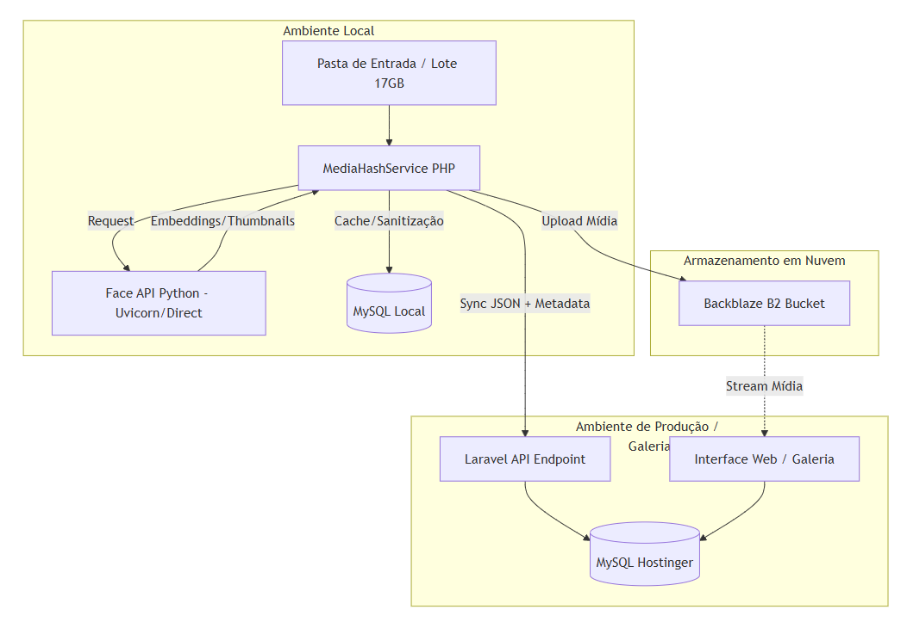

# 🏛️ Arquitetura Distribuída DupMedia v3.0

Este documento descreve a estrutura de processamento híbrido: **Processamento Local (Worker)** 
+ **Hospedagem em Nuvem (VPS/Storage)**.


## 1. Visão Geral do Fluxo
1. **LOCAL:** Processamento pesado (Hashes, IA de Face, Thumbnails).
2. **UPLOAD:** Envio da mídia higienizada para o Cloud Storage (Backblaze B2).
3. **SINCRONIZAÇÃO:** Envio de metadados via JSON para a VPS (Hostinger).

---

## 2. Camada Local (O Worker)
Responsável por poupar os recursos da VPS e utilizar o hardware local (CPU/GPU).

### A. MediaHashService
- **Identificação:** Gera `file_hash` (binário) e `pHash` (perceptual).
- **Sanitização:** Compara hashes locais para evitar duplicatas antes do upload.
- **Extração de Metadados:** Resolução, FPS, duração, tamanho, data de criação.

### B. Face API (Python)
- **Detecção:** Localiza rostos na imagem/vídeo.
- **Embeddings:** Gera vetores numéricos das faces.
- **Thumbnails:** Recorta e salva a miniatura da face (JPEG leve).

---
## 3. Camada de Nuvem (A Vitrine)
Responsável por servir a galeria e organizar as buscas.

### A. VPS (Hostinger - Laravel)
- **API Endpoint:** `/api/v1/sync-media` (Recebe o JSON do Worker).
- **Banco de Dados:** MySQL/PostgreSQL armazenando os relacionamentos.
- **Web Interface:** Painel administrativo para visualização e busca.

### B. Cloud Storage (Backblaze B2)
- **Arquivos Originais:** Armazena os vídeos e fotos pesados.
- **CDN (Cloudflare):** Cache para entrega rápida das mídias na web.

---
## 4. Estrutura do Pacote de Sincronização (JSON)
O Worker local deve enviar um POST para a VPS com este formato:

```json
{
  "api_token": "TOKEN_DE_SEGURANCA_GERADO_NA_VPS",
  "media_info": {
    "hash": "8f3e9a...",
    "phash": "a1c2...",
    "file_name": "video_01.mp4",
    "storage_path": "caminho/no/b2/arquivo.mp4",
    "gallery_name": "Priv",
    "best_dist_config": 0.35
  },
  "faces": [
    {
      "box": [x, y, w, h],
      "embedding": [0.123, -0.456, "..."],
      "thumbnail_b64": "base64_da_imagem_da_face"
    }
  ]
}

Sem problemas! Ter essa estrutura em um arquivo .md (Markdown) é essencial para servir como o seu "Manual de Arquitetura" durante o desenvolvimento.

Aqui está o conteúdo estruturado para você salvar como arquitetura_dupmedia.md:

Markdown
# 🏛️ Arquitetura Distribuída DupMedia v3.0

Este documento descreve a estrutura de processamento híbrido: **Processamento Local (Worker)** + **Hospedagem em Nuvem (VPS/Storage)**.

## 1. Visão Geral do Fluxo
1. **LOCAL:** Processamento pesado (Hashes, IA de Face, Thumbnails).
2. **UPLOAD:** Envio da mídia higienizada para o Cloud Storage (Backblaze B2).
3. **SINCRONIZAÇÃO:** Envio de metadados via JSON para a VPS (Hostinger).

---

## 2. Camada Local (O Worker)
Responsável por poupar os recursos da VPS e utilizar o hardware local (CPU/GPU).

### A. MediaHashService
- **Identificação:** Gera `file_hash` (binário) e `pHash` (perceptual).
- **Sanitização:** Compara hashes locais para evitar duplicatas antes do upload.
- **Extração de Metadados:** Resolução, FPS, duração, tamanho, data de criação.

### B. Face API (Python)
- **Detecção:** Localiza rostos na imagem/vídeo.
- **Embeddings:** Gera vetores numéricos das faces.
- **Thumbnails:** Recorta e salva a miniatura da face (JPEG leve).

---

## 3. Camada de Nuvem (A Vitrine)
Responsável por servir a galeria e organizar as buscas.

### A. VPS (Hostinger - Laravel)
- **API Endpoint:** `/api/v1/sync-media` (Recebe o JSON do Worker).
- **Banco de Dados:** MySQL/PostgreSQL armazenando os relacionamentos.
- **Web Interface:** Painel administrativo para visualização e busca.

### B. Cloud Storage (Backblaze B2)
- **Arquivos Originais:** Armazena os vídeos e fotos pesados.
- **CDN (Cloudflare):** Cache para entrega rápida das mídias na web.

---

## 4. Estrutura do Pacote de Sincronização (JSON)
O Worker local deve enviar um POST para a VPS com este formato:

```json
{
  "api_token": "TOKEN_DE_SEGURANCA_GERADO_NA_VPS",
  "media_info": {
    "hash": "8f3e9a...",
    "phash": "a1c2...",
    "file_name": "video_01.mp4",
    "storage_path": "caminho/no/b2/arquivo.mp4",
    "gallery_name": "Priv",
    "best_dist_config": 0.35
  },
  "faces": [
    {
      "box": [x, y, w, h],
      "embedding": [0.123, -0.456, "..."],
      "thumbnail_b64": "base64_da_imagem_da_face"
    }
  ]
}

## 6. Estratégia de Consumo (Pós-Legado)
Para novas entradas esporádicas, será adotado o modelo **On-Demand**:

- **Gatilho:** O MediaHashService inicia o processo ao detectar arquivo na pasta de monitoramento.
- **Persistência:** A API permanece ativa apenas enquanto houver fila de processamento.
- **Timeout:** Encerramento automático do processo Python após 10 minutos de inatividade para liberação de memória RAM.

2. Opção: Lazy Load com "Auto-Shutdown" (O Equilíbrio)
6.1 Esta é a minha recomendação técnica para o seu perfil de uso:

O MediaHashService detecta uma foto nova.

Ele tenta enviar para a API (localhost:8000).

Se falhar (API offline): O PHP executa o comando para ligar o uvicorn em background.

O PHP espera o tempo de "Warm-up" e envia a foto.

O Pulo do Gato: Você adiciona um pequeno código no Python que monitora o tempo. Se a API ficar 10 minutos sem receber requisições, ela executa um os._exit(0) e se desliga.

5. Próximos Passos (Pós-Sanitização)
Configurar API na VPS: Criar as rotas de recepção e proteção por Token.

Dispatcher Local: Criar o script que lê o banco local e "empurra" os dados para a VPS.

Configuração S3: Ligar o Laravel ao bucket do Backblaze B2.

### Dica para o Futuro:
Quando você começar a enviar esses dados, recomendo que o seu script local marque no banco de dados local uma coluna chamada `synced_at`. Assim, você nunca envia o mesmo arquivo duas vezes para a sua VPS Hostinger.


**Como está a limpeza dos 17GB? Já encontrou muitas duplicatas pelo hash?** Quando terminar, é só me chamar para transformarmos esse `.md` em código real!


## 7. Persistência de Dados (MySQL Hostinger)
- **Embeddings:** Serão armazenados como `JSON` ou `LONGTEXT` na tabela `faces`.
- **Cálculo de Similaridade:** Realizado na camada de aplicação (PHP via Math ou Python API) para contornar a falta de suporte nativo a vetores no MySQL.
- **Otimização:** Uso de índices em `media_hash` e `phash` para buscas rápidas de duplicatas binárias.

## 8. Decisão Tecnológica: Vetores no MySQL
- **Motivo:** Simplificação de infraestrutura (Hostinger) e incompatibilidade do pgvector no ambiente Windows local.
- **Implementação:** Armazenamento em coluna tipo `JSON`.
- **Cálculo de Similaridade:** Delegado para a camada de aplicação (PHP/Python) para garantir portabilidade entre Local e VPS.